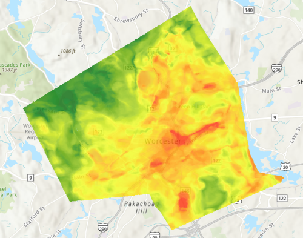

# Data Scientist Portfolio
---
## Education &  Skills
**Worcester Polytechnic Institute**, Anticipated 2025 graduation
Bachelor of Science in Data Science, Minor in Computer Science, GPA 3.72

**Programming Languages:** Python, Java, R, SQL, C, C++, 
**Applications:** ArcGIS, Oracle, Github, Flourish, Microsoft Office (Excel, Word, PowerPoint), Adobe Photoshop, VirtualBox, RStudio, Tableau, MATLAB
Data Science Skills: Data visualization, D3 library, spatial optimization, machine learning, predictive modeling, data management, data mining, statistical analysis

## Work Experience
### Research Position - Global Lab Assistant
•	Cleaned, visualized, and analyzed waste data from New England's nuclear power plants for the Citizens Awareness Network.
•	Created an ArcGIS story map and interactive data visualizations in Flourish.
•	Performed community outreach and mentored two data science students, resulting in improved, polished products of data visualizations. 

## Projects
### Optimizing Locations for Climate Resilience Interventions
•	Determined ideal placements for cool routes using heat map analysis and pedestrian traffic patterns, directly impacting citizens by offering shaded pathways during peak summer heat.
•	Researched, analyzed and cleaned datasets, resulting in an interactive map exceeding current state-of-the-art methods. 
•	Focused on spatial optimization and adapting to climate change with ArcGIS.

Here is an example of some of the data I worked with: 

My team's raster data of Worcester's temperature obtained from the Global Lab; and shade data, obtained from ShadeMap. My personal work on this project involved processing this data so it could be used as costs for pathing in ArcGIS. Temperature data was turned into integer format from float, then combined with Shade Data via the raster calculator tool. From there, our new cost raster was turned into a polygon layer so as to access the attribute table. 

Process
There was a lot of useful trial and error throughout this project. The best example of my learning process throughout is how we picked the tool we would use. There were several options in ArcGIS, and I decided which tool would be best to use; the route analysis tool with polygon costs. An issue we ran into early on was that the pathing data was too information heavy to correctly run a route analysis. A solution I proposed involved creating our own network dataset of Worcester sidewalks, instead of using ArcGIS' default network. After proposing to my team, we worked through the issue together and were able to create our final prototype. 

Our final prototype
After working with our front and backend developer, our team finalized our prototype for cool routes in Worcester. We are looking forward to adding a way to add potential locations for street tree planting. 

### Data in D3: Exploring Housing After Graduation
Working in a team of 4, I helped choose data for analysis, synthesize a question/purpose, and create data visualizations in order to see where we could live after graduation. Our final product was 4 data visualizations on a website, in addition a 2 minute recording I narrated talking through our design. 
Throughout our work we kept a detailed process book. This included drafts of data visualizations and how we worked through any challenges as a team. Here is some of my progress, as well as a link to the Github pages link for our data visulizations. 

### Horse Genetics Excel Project
 - A personal project to create a creative excel sheet. [WIP]
